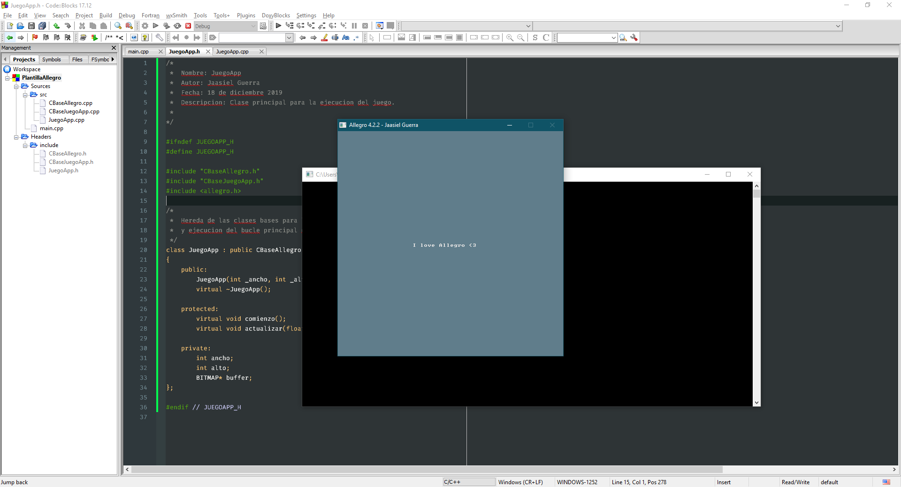

# Plantilla-Allegro-4

## Descripción

- Plantilla para la creación de juegos usando allegro version 4 con codeblocks IDE.

## Importante

**Las configuraciones y requisitos para usar la plantilla son las siguientes:**

- Allegro version 4.2.2.
- Compilador MinGW (ya que este se usó para la creación de la plantilla).
- Codeblocks Version 17.12
- Acivar C++ 11 ISO en los flags del compilador
